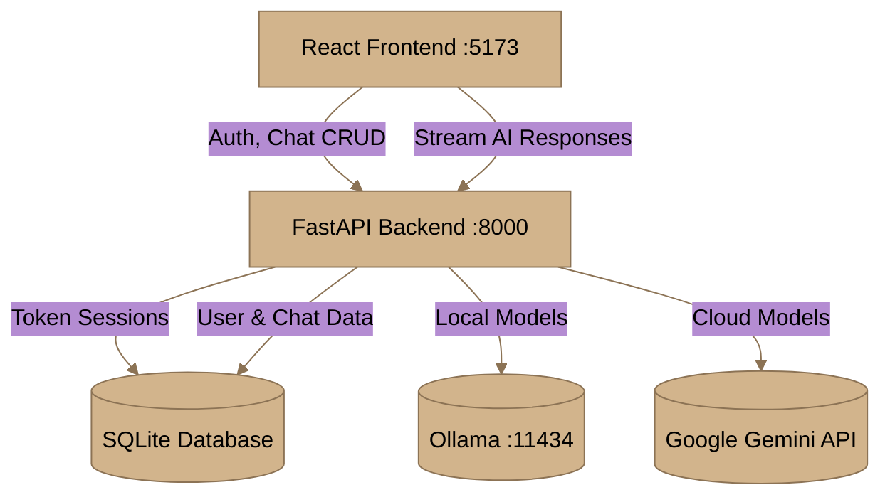
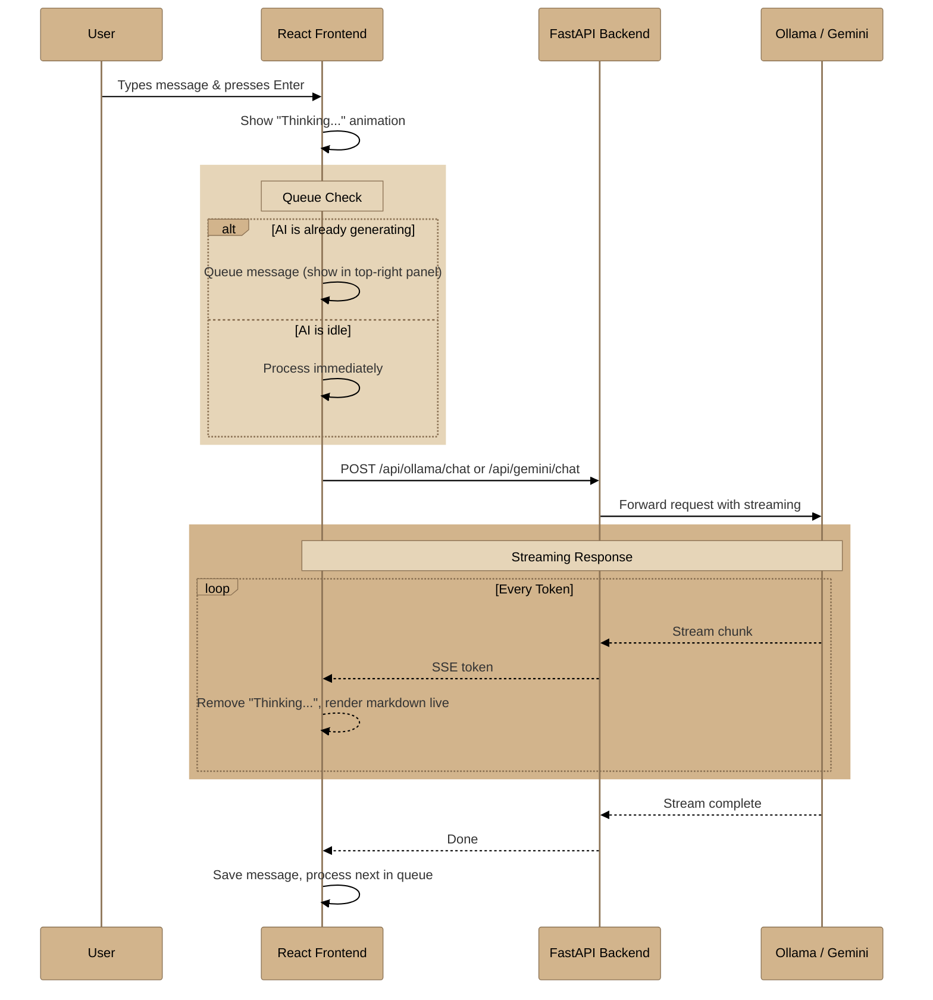

# Kortex — AI Chat Platform

A full-stack AI chat application with a **React** frontend and **FastAPI** backend. Supports both **local Ollama models** (fully offline) and **Google Gemini API** (cloud). Features real-time streaming, user authentication, conversation management, and a professional UI.

---

## Quick Start

### Prerequisites
- **Node.js** ≥ 18 & **npm**
- **Python** ≥ 3.11
- **Ollama** ([ollama.com](https://ollama.com)) — for local models
- **Google Gemini API key** — for online mode (optional)

### 1. Clone & Setup Environment

```bash
git clone https://github.com/GaganCB2002/chat.git
cd chat
```

Create a `.env` file in the project root:

```env
GEMINI_API_KEY=your_gemini_api_key_here
VITE_GEMINI_API_KEY=your_gemini_api_key_here
```

> The `JWT_SECRET` is auto-generated on first backend startup if not present.

### 2. Start Backend

```bash
cd backend
pip install -r requirements.txt
uvicorn main:app --port 8000
```

### 3. Start Frontend

```bash
cd chat-frontend
npm install
npm run dev
```

### 4. Start Ollama (for local models)

```bash
ollama pull gemma2:2b
ollama pull qwen3.5:latest
.\start-ollama.bat
```

Or run everything at once with:

```bash
.\start.bat
```

The app will be available at **http://localhost:5173**

---

## Features

### 🤖 AI Chat
- **Dual Mode** — Switch between offline Ollama models and online Google Gemini
- **Streaming Responses** — Real-time token-by-token streaming with live markdown rendering
- **Thinking Animation** — Animated "Thinking..." indicator with spinner while AI processes
- **Message Queue** — Messages sent during generation are queued and processed sequentially with a collapsible queue panel in the top-right corner showing real-time progress
- **Stop Generation** — Cancel AI response mid-generation
- **Regenerate** — Re-generate the last assistant response
- **Edit & Delete** — Edit sent messages or delete them
- **Copy & Share** — Copy message content with one click
- **Like/Dislike** — Rate assistant responses

### 🔐 Authentication & Security
- **User Registration & Login** — Full account system with email, first/last name, password
- **Database-Backed Sessions** — Secure token-based auth stored in SQLite (no JWT)
- **Password Reset** — Forgot password flow using Ethereal Email (temporary SMTP for local dev)
- **bcrypt Hashing** — Passwords hashed with bcrypt via Passlib
- **Trial System** — 5 free messages for unauthenticated users
- **CAPTCHA** — Simple math captcha on registration

### 📁 File & Media
- **Drag & Drop** — Drop files/images directly onto the chat input
- **File Upload** — Upload images, documents, code, archives via paperclip button
- **File Context** — Uploaded files are automatically attached as context to messages
- **Image Preview** — Inline image rendering with click-to-open lightbox

### 💬 Chat Management
- **Conversation History** — All chats saved locally with full search
- **Chat Export** — Export conversations as JSON or TXT
- **Folders** — Organize chats into folders (Work, Personal, Research, Learning)
- **Pin Messages** — Pin important messages for quick reference
- **Auto-Summarize** — Automatic title generation after first exchange
- **Message Search** — Ctrl+F to search within current chat with result navigation
- **Scroll to Bottom** — Down-arrow button on the left to jump to latest message

### 🎨 UI & Experience
- **Dashboard** — Active model status, live task queue with progress bars, recent conversations
- **Command Palette** — Ctrl+K to quickly search chats and trigger actions
- **Theme** — Light/Dark/System mode with smooth CSS transitions
- **Responsive** — Mobile-friendly with collapsible sidebar
- **Keyboard Shortcuts** — Full suite of shortcuts (see table below)
- **Speech-to-Text** — Voice input via Web Speech API (mic button)
- **Markdown Rendering** — Full renderer with code blocks, tables, Mermaid diagrams, blockquotes, lists, images, and links

---

## Project Architecture

```
chat/
├── .env                      # Environment variables (API keys, secrets)
├── start.bat                 # One-click launcher for everything
├── start-ollama.bat          # Ollama server launcher
│
├── backend/                  # FastAPI Backend
│   ├── main.py               # App entry point, CORS, lifespan
│   ├── requirements.txt      # Python dependencies
│   ├── generate_secret.py    # Auto-generates JWT_SECRET in .env
│   ├── app/
│   │   ├── auth.py           # Token creation, password hashing, session validation
│   │   ├── database.py       # Async SQLAlchemy engine & session factory
│   │   ├── models.py         # User, AuthToken, Chat, Message ORM models
│   │   ├── schemas.py        # Pydantic request/response schemas
│   │   └── routers/
│   │       ├── auth.py       # /api/auth/* — register, login, logout, forgot-password
│   │       ├── chats.py      # /api/chats/* — CRUD for conversations
│   │       ├── gemini.py     # /api/gemini/* — Google Gemini streaming proxy
│   │       └── ollama.py     # /api/ollama/* — Ollama streaming proxy
│   └── kortex.db             # SQLite database (auto-created)
│
└── chat-frontend/            # React Frontend
    ├── package.json
    ├── vite.config.ts
    └── src/
        ├── api/              # HTTP clients (ollama.ts, gemini.ts)
        ├── components/
        │   ├── auth/         # AuthModal, Captcha
        │   ├── chat/         # ChatView, ChatInput, ChatMessage, TypingIndicator
        │   ├── common/       # CommandPalette
        │   ├── layout/       # AppShell
        │   ├── sidebar/      # Sidebar
        │   ├── topbar/       # TopBar
        │   └── ui/           # Button, Dialog, Tooltip primitives
        ├── stores/           # Zustand stores (chat, auth, settings)
        ├── types/            # TypeScript type definitions
        └── utils/            # Markdown renderer, export helpers
```

---

## Architecture Diagram



---

## API Endpoints

### Authentication (`/api/auth`)

| Method | Endpoint | Description |
|--------|----------|-------------|
| `POST` | `/api/auth/register` | Create a new user account |
| `POST` | `/api/auth/login` | Login and receive session token |
| `POST` | `/api/auth/logout` | Invalidate current session |
| `GET`  | `/api/auth/me` | Get current user profile |
| `POST` | `/api/auth/forgot-password` | Trigger password reset via Ethereal Email |

### Chat (`/api/chats`)

| Method | Endpoint | Description |
|--------|----------|-------------|
| `GET`  | `/api/chats/` | List user's conversations |
| `POST` | `/api/chats/` | Create a new conversation |
| `GET`  | `/api/chats/{id}` | Get conversation by ID |
| `DELETE` | `/api/chats/{id}` | Delete a conversation |

### AI Providers

| Method | Endpoint | Description |
|--------|----------|-------------|
| `GET`  | `/api/ollama/` | Check Ollama connection status |
| `GET`  | `/api/ollama/tags` | List available local models |
| `POST` | `/api/ollama/chat` | Stream chat completion from Ollama |
| `POST` | `/api/gemini/chat` | Stream chat completion from Gemini |

---

## Complete Message Flow



---

## Tech Stack

### Frontend
| Technology | Purpose |
|-----------|---------|
| **React 19** | UI framework |
| **TypeScript** | Type safety |
| **Zustand** | Global state management with persist |
| **Tailwind CSS v4** | Utility-first styling with dark mode |
| **Framer Motion** | Animations and transitions |
| **Lucide React** | SVG icon library |
| **Radix UI** | Accessible dialog/dropdown/tooltip primitives |
| **react-virtuoso** | Virtualized chat message list |

### Backend
| Technology | Purpose |
|-----------|---------|
| **FastAPI** | Async Python web framework |
| **SQLAlchemy 2.0** | Async ORM with SQLite |
| **aiosqlite** | Async SQLite driver |
| **Passlib + bcrypt** | Password hashing |
| **aiosmtplib** | Async SMTP for password reset emails |
| **httpx** | Async HTTP client for AI provider proxying |
| **Pydantic v2** | Request/response validation |
| **Uvicorn** | ASGI server |

### Supported Models

| Model | Provider | Type | Size |
|-------|----------|------|------|
| Qwen 3.5 | Alibaba via Ollama | Local | ~2.7 GB |
| Gemma 2 | Google via Ollama | Local | ~5.4 GB |
| Llama 3.2 | Meta via Ollama | Local | ~3.2 GB |
| Phi-3 Mini | Microsoft via Ollama | Local | ~2.5 GB |
| Mistral | Mistral AI via Ollama | Local | ~7 GB |
| Gemini 2.5 Flash | Google | Cloud | Online only |

---

## Keyboard Shortcuts

| Shortcut | Action |
|----------|--------|
| `Enter` | Send message |
| `Shift + Enter` | New line |
| `Ctrl + N` | New chat |
| `Ctrl + K` | Command palette |
| `Ctrl + F` | Search in chat |
| `Ctrl + B` | Toggle sidebar |
| `Ctrl + Shift + T` | Toggle theme |
| `Ctrl + L` | Clear input |
| `Ctrl + Shift + F` | Search chats |
| `Escape` | Clear input / Close modals |
| `/` | Focus input |

---

## Environment Variables

| Variable | Required | Description |
|----------|----------|-------------|
| `GEMINI_API_KEY` | For online mode | Google Gemini API key (backend) |
| `VITE_GEMINI_API_KEY` | For online mode | Same key exposed to frontend via Vite |
| `JWT_SECRET` | Auto-generated | Secret for session token generation |

---

## License

This project is for personal and educational use.
