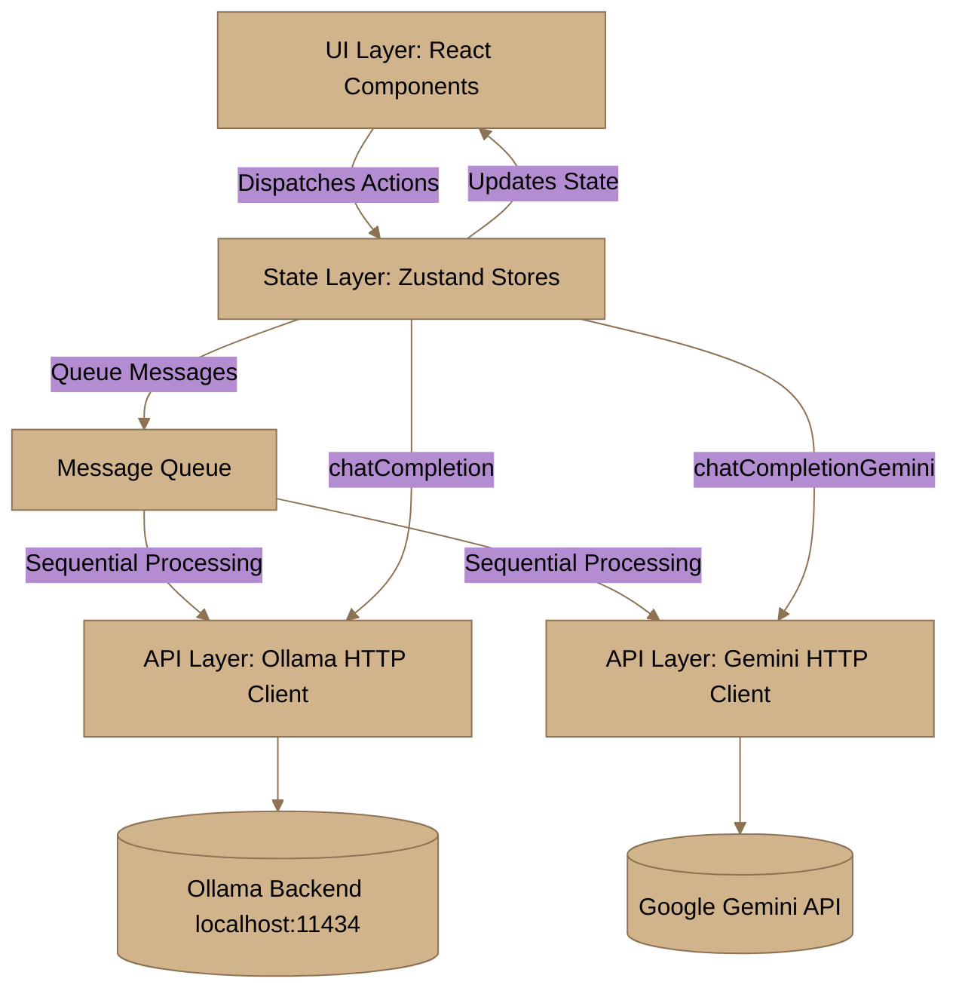
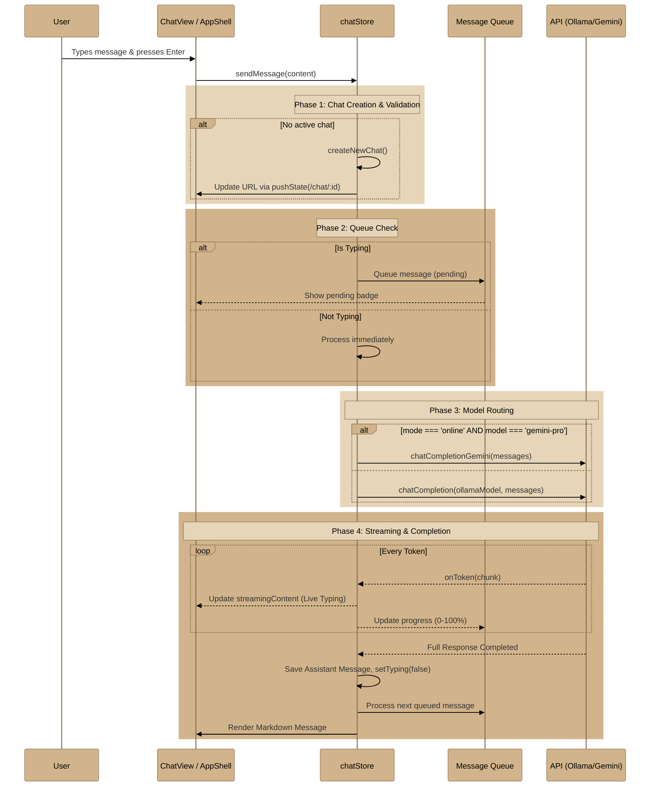
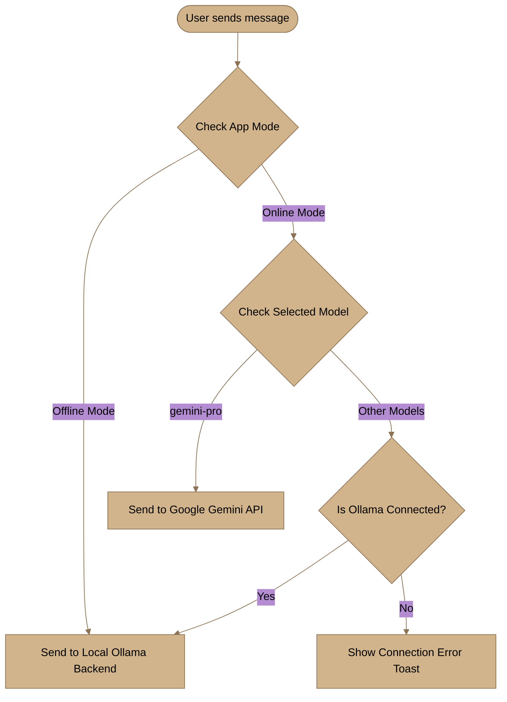
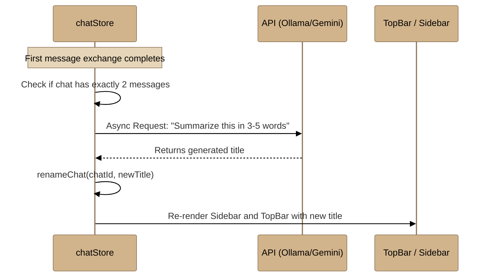
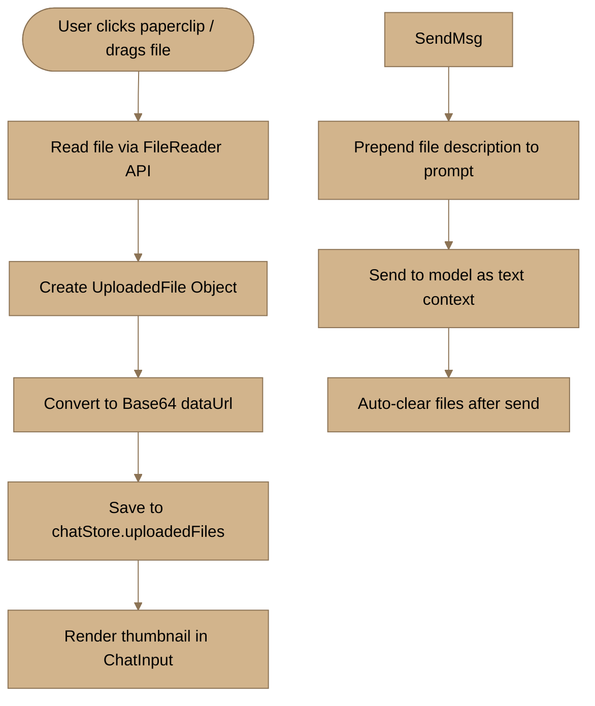

# Kortex — Local & Online AI Chat

A fully local AI chat application that runs against **Ollama** models on your machine, with optional **Online Mode** utilizing the **Google Gemini API**. Built with React 19, TypeScript, Zustand, and Tailwind CSS.

---

## Quick Start

```bash
# Step 1: Install Ollama (https://ollama.com) and pull models
ollama pull qwen3.5:2b
ollama pull llama3.2:1b

# Step 2: Start the Ollama server (keeps models loaded in RAM)
.\start-ollama.bat

# Step 3: Install project dependencies & start
npm install
npm run dev
```

---

## Features

### Core Chat
- **Local & Cloud AI**: Switch between offline Ollama models and online Google Gemini
- **Streaming Responses**: Real-time token-by-token streaming with live markdown rendering and a blinking cursor
- **AI Thinking Panel**: Beautifully simulated thinking stages (Understanding Request → Planning → Searching Context → Writing Response)
- **Message Queue**: Messages sent during generation are queued and auto-processed sequentially
- **Flawless Interrupts**: Cancel AI response mid-generation and save the exact partial response to history
- **Message Status**: Real-time indicators for sent, generating, interrupted, and failed messages
- **Regenerate & Edit**: Re-generate responses or edit your prompts seamlessly
- **Like/Dislike**: Rate assistant responses

### File & Media
- **Drag & Drop**: Drop files/images directly onto the chat input
- **File Upload**: Upload images, documents, code, archives via paperclip button
- **File Context**: Uploaded files are automatically attached as context to messages
- **Image Preview**: Inline image rendering with click-to-open lightbox

### Chat Management & Organization
- **Chronological Sidebar**: Chats dynamically group into *Today*, *Yesterday*, *Previous 7 Days*, *Previous 30 Days*, and *Older*
- **Action Dropdowns**: Every chat features a rich context menu to Duplicate, Archive, Export, Pin, or Favorite
- **True Persistence**: Robust state recovery—refreshing the browser restores the exact sidebar layout, open chat, model selection, and uploaded files perfectly
- **Chat Export**: Download any conversation as a clean Markdown file
- **Folders**: Organize chats into custom folders (Work, Personal, Research, Learning)
- **Auto-Summarize**: Automatic title generation after the first exchange
- **Message Search**: Ctrl+F to search within the current chat with result navigation

### UI & Experience
- **Virtual Scrolling**: Integrated `react-virtuoso` guarantees 60fps scrolling and zero lag, even for conversations with thousands of messages
- **Dashboard**: Active model status, live token/request quotas, task queue progress, and recent conversations
- **Command Palette**: Ctrl+K to quickly search chats and trigger actions
- **Theme**: Light/Dark/System mode with smooth CSS transitions
- **Responsive**: Mobile-friendly with an animated collapsible sidebar
- **Keyboard Shortcuts**: Ctrl+N (new chat), Ctrl+Shift+T (theme), Ctrl+B (sidebar), and more
- **Speech-to-Text**: Voice input via Web Speech API
- **Developer Mode**: Bottom status bar showing model, Ollama status, and version info

### Markdown Support
- **Full Renderer**: Bold, italic, inline code, code blocks with copy button
- **Tables**: Full table rendering with headers
- **Strikethrough**: ~~text~~ support
- **Images**: Inline image display
- **Links**: Clickable links opening in new tab
- **Blockquotes & Lists**: Nested quotes and ordered/unordered lists

### Authentication & Security
- **User Accounts**: Register/login with localStorage persistence
- **Trial System**: 5 free messages for unauthenticated users
- **Error Boundary**: Prevents white-screen crashes with graceful error recovery
- **CAPTCHA**: Simple math captcha for registration

---

## Project Architecture



---

## Complete Input Flow



---

## Online vs Offline Mode Flow

The application intelligently routes requests based on the selected mode.



---

## Auto-Summarize Flow

Automatically generates a descriptive title for new chats.



---

## File Upload Flow

Supports both click-to-upload and drag-and-drop.



---

## Tech Stack & Mode Mapping

### Core Stack
- **React 19 & TypeScript**: Robust, type-safe UI layer
- **Zustand**: Lightweight global state management with persist middleware
- **Tailwind CSS (v4)**: Utility-first styling with dark mode support
- **Framer Motion**: Layout-aware animations and transitions
- **Lucide React**: Clean, modern SVG icons
- **Radix UI**: Accessible dialog, dropdown, tooltip primitives

### Mode-Specific Backend Technologies

**1. Offline Mode (Local Processing)**
- **Tech:** Ollama (Local REST API) + Local GGUF Models
- **Purpose:** 100% private, air-gapped operation. All requests go to `127.0.0.1:11434`. Models kept in RAM (`OLLAMA_KEEP_ALIVE=-1`) for zero-latency responses. Supports any Ollama model (Qwen, Llama, Phi, Gemma, Mistral, etc.)

**2. Online Mode (Cloud Processing)**
- **Tech:** Google Gemini API (REST over HTTP) + Gemini 1.5 Pro
- **Purpose:** Unlocks cloud-based capabilities for advanced reasoning tasks too heavy for local hardware.

### Supported Models

| Model ID | Name | Provider | Size |
|----------|------|----------|------|
| `qwen3.5` | Qwen 3.5 | Alibaba via Ollama | 2B (~2.7GB) |
| `phi3` | Phi-3 Mini | Microsoft via Ollama | 3.8B (~2.5GB) |
| `kortex-lite` | Kortex Lite | Ollama | 3.8B (aliased to Phi-3) |
| `kortex-pro` | Kortex Pro | Ollama | 3.2B (aliased to Llama) |
| `gemma4` | Gemma 4 | Google via Ollama | 9B (~8.9GB) |
| `llama3` | Llama 3.2 | Meta via Ollama | 3.2B |
| `mistral` | Mistral | Mistral AI via Ollama | 7B |
| `gemini-pro` | Gemini 1.5 Pro | Google | Cloud (Online only) |

---

## Keyboard Shortcuts

| Shortcut | Action |
|----------|--------|
| `Enter` | Send message |
| `Shift + Enter` | New line |
| `Ctrl + N` | New chat |
| `Ctrl + K` | Command palette |
| `Ctrl + F` | Search in chat |
| `Ctrl + B` | Toggle sidebar |
| `Ctrl + Shift + T` | Toggle theme |
| `Ctrl + L` | Clear input |
| `Ctrl + Shift + F` | Search chats |
| `Escape` | Clear input / Close modals |
| `/` | Focus input |
