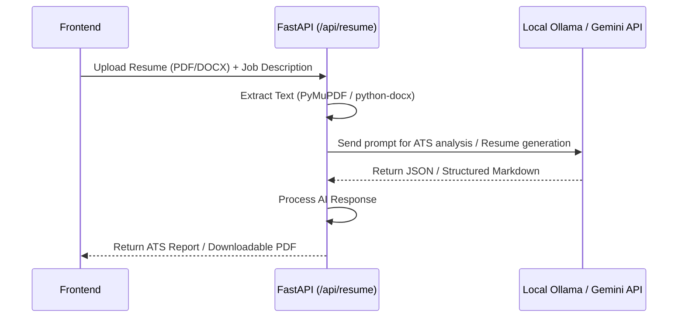

# Backend Service

The **Kortex Backend** is a highly asynchronous FastAPI application that powers the Kortex AI Chat Platform. It serves as the bridge between the frontend and the AI models (both local Ollama models and the cloud-based Google Gemini API). 

### Key Features
- **Session Management**: Custom token-based authentication with bcrypt password hashing.
- **AI Proxying**: Streams responses directly from AI providers to the client.
- **Document Processing**: Parses PDF/DOCX files for ATS resume optimization.
- **Data Persistence**: Uses asynchronous SQLAlchemy with a local SQLite database for fast and reliable storage.

## Project Structure

```text
backend/
├── main.py               # App entry point, CORS, and application lifecycle
├── requirements.txt      # Python dependencies
├── generate_secret.py    # Utility to generate JWT_SECRET
├── app/
│   ├── auth.py           # Core authentication logic (token generation, hashing)
│   ├── database.py       # Async SQLAlchemy engine & session setup
│   ├── models.py         # ORM models (User, Chat, Message, AuthToken)
│   ├── schemas.py        # Pydantic schemas for data validation
│   └── routers/
│       ├── auth.py       # Endpoints: Login, Register, Logout, Password Reset
│       ├── chats.py      # Endpoints: CRUD operations for chats and messages
│       ├── gemini.py     # Endpoints: Proxy for Google Gemini chat streaming
│       ├── ollama.py     # Endpoints: Proxy for Ollama model management and chat
│       └── resume.py     # Endpoints: ATS resume analysis and file parsing
└── kortex.db             # SQLite database (auto-created at runtime)
```
## Architecture & Data Flow

The backend handles incoming requests from the React frontend, interacts with the local SQLite database for persistence, and proxies AI requests to either local Ollama models or the Google Gemini API.

```mermaid
%%{init: {'theme': 'base', 'themeVariables': { 'primaryColor': '#d2b48c', 'primaryTextColor': '#000', 'primaryBorderColor': '#8c7355', 'lineColor': '#8c7355'}}}%%
graph TD
    Client[React Frontend] -->|HTTP / API Calls| FastAPI[FastAPI App (main.py)]
    
    subgraph FastAPI Application
        FastAPI --> AuthRouter[Auth Router (/api/auth)]
        FastAPI --> ChatRouter[Chat Router (/api/chats)]
        FastAPI --> GeminiRouter[Gemini Router (/api/gemini)]
        FastAPI --> OllamaRouter[Ollama Router (/api/ollama)]
        FastAPI --> ResumeRouter[Resume Router (/api/resume)]
    end

    AuthRouter -->|CRUD Users / Sessions| DB[(SQLite: kortex.db)]
    ChatRouter -->|CRUD Chats & Messages| DB
    
    GeminiRouter -.->|Stream AI Response| GeminiAPI[(Google Gemini API)]
    OllamaRouter -.->|Stream AI Response| LocalOllama[(Local Ollama)]
    ResumeRouter -.->|Process Document| LocalOllama
    ResumeRouter -.->|Process Document| GeminiAPI
```

## Resume Optimization Flow


