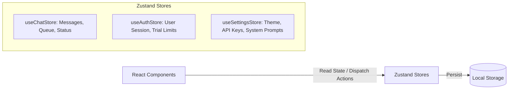

# Frontend Service

The **Kortex Frontend** is a modern, responsive React application built with Vite and Tailwind CSS. It provides a professional, highly interactive user interface for engaging with AI models, managing conversation history, and utilizing specialized tools like the ATS Resume Optimizer.

### Key Features
- **Real-time Streaming**: Renders markdown instantly as tokens stream from the backend.
- **Local First**: Prioritizes fast, responsive state management using Zustand and local storage.
- **Rich Media**: Supports file drag-and-drop, inline code blocks, and Mermaid diagram rendering.
- **Specialized Workflows**: Includes dedicated views for multi-turn chatting and one-shot ATS resume analysis.

## Project Structure

```text
chat-frontend/
├── package.json
├── vite.config.ts
└── src/
    ├── api/              # HTTP clients for backend endpoints (gemini, ollama, chats)
    ├── components/
    │   ├── auth/         # Authentication modals and Captcha
    │   ├── chat/         # Core chat interface (Input, Message List, Streaming logic)
    │   ├── common/       # Shared UI components like Command Palette
    │   ├── layout/       # Main AppShell and structural wrappers
    │   ├── resume/       # Resume optimizer and ATS report components
    │   ├── sidebar/      # Sidebar for chat history and folders
    │   ├── topbar/       # Header containing model selection and queue status
    │   └── ui/           # Reusable Radix UI / Tailwind primitives
    ├── stores/           # Zustand state management (chatStore, authStore, settingsStore)
    ├── types/            # Global TypeScript definitions
    └── utils/            # Helper functions for markdown rendering and exports
```
## Architecture & Component Flow

The frontend is built with React 19, Vite, and Zustand for state management. It communicates with the FastAPI backend for data persistence and AI model interactions.

```mermaid
%%{init: {'theme': 'base', 'themeVariables': { 'primaryColor': '#d2b48c', 'primaryTextColor': '#000', 'primaryBorderColor': '#8c7355', 'lineColor': '#8c7355'}}}%%
graph TD
    AppShell[AppShell (Layout)] --> Sidebar[Sidebar (Chat History & Folders)]
    AppShell --> TopBar[TopBar (Model Selection & Status)]
    AppShell --> MainContent[Main Content Area]

    MainContent --> ChatView[Chat View]
    MainContent --> ResumeOptimizer[Resume Optimizer View]

    subgraph Chat Flow
        ChatView --> ChatMessageList[Message List (Virtualized)]
        ChatView --> ChatInput[Chat Input (Text, File Upload, Voice)]
        ChatInput -->|Send Message| ChatStore[(Zustand Chat Store)]
        ChatStore -->|API Request| BackendAPI[Backend API (/api/chats, /api/ollama, /api/gemini)]
    end

    subgraph Resume Flow
        ResumeOptimizer --> ATSReport[ATS Report & Analysis]
        ResumeOptimizer --> ResumeUpload[Upload Resume & Job Description]
        ResumeUpload -->|Submit Data| ResumeAPI[Backend API (/api/resume)]
    end

    subgraph Authentication
        AuthStore[(Zustand Auth Store)] --> AuthModal[Auth Modal (Login / Register)]
        AuthModal -->|Credentials| BackendAPI
    end
```

## State Management

We use **Zustand** for global state management to ensure smooth and reactive updates across components.


